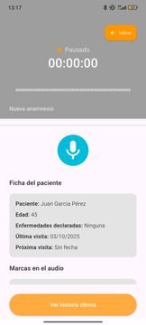
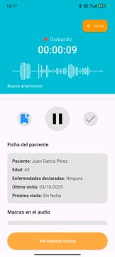
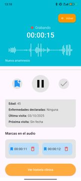
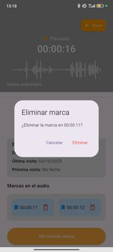
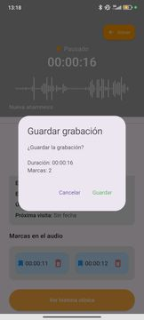
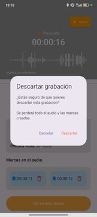
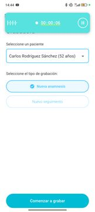
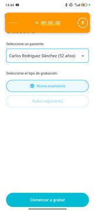

# 🎙️ Grabador de Audio - Flutter

Aplicación Flutter para grabación de audio con interfaz intuitiva, optimizada para Android e iOS.

## ✨ Características

- 🎤 **Grabación de audio AAC** 
- 📁 **Almacenamiento accesible** en carpeta Descargas/Recordings (en Android)
- 📱 **UI responsive** con animaciones fluidas
- 🔐 **Gestión de permisos** automática

## 📱 Capturas











### Permisos (AndroidManifest.xml)
```xml
<uses-permission android:name="android.permission.RECORD_AUDIO" />
<uses-permission android:name="android.permission.WRITE_EXTERNAL_STORAGE" />
<uses-permission android:name="android.permission.READ_EXTERNAL_STORAGE" />
```

## 📦 Dependencias Principales

```yaml
dependencies:
  flutter_sound: ^9.3.8
  permission_handler: ^12.0.1
  path_provider: ^2.0.16
  share_plus: ^12.0.0
```


